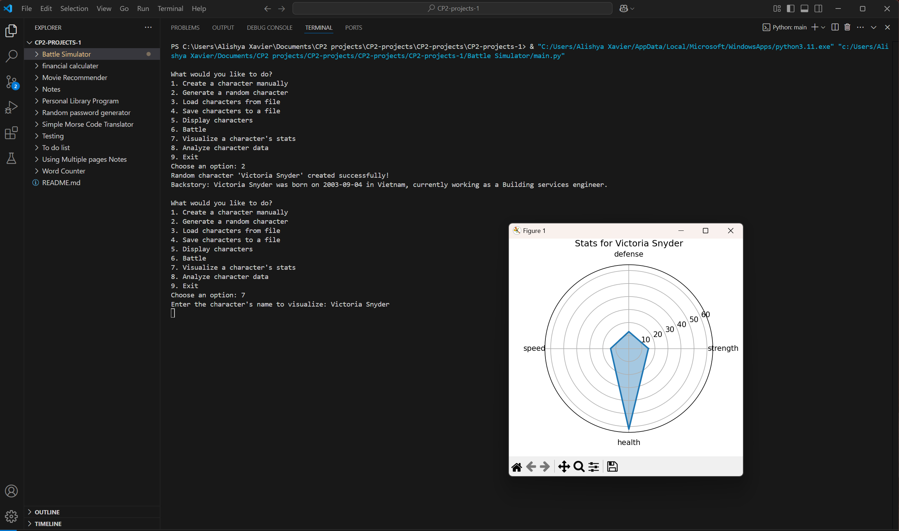

# Updated Battle Simulator

## Project Description
---
The purpose of this project is to improve my old Battle Simulator Project by implementing data visualization, statistical analysis, and random data generation using Python libraries. What was used to complete this project were Madplotlib for character stat visualization, Pandas for data manipulation and basic statistical analysis, and Faker for generating random character names and descriptions. These things were incorporated to the original code to improve the code by displaying the character's stats, loading the character's data into a DataFrame, and create random characters with different backstories. With this another thing that was changed was the main menu to be able to access new visualization and analysis features. Also on top of that to demonstrate knowledge and understanding of the library documentation, an aditional feature that was not required was added. This feature was assigning random weapons to characters using the Faker.

## Execution and Usage
---
To use this project what you have to do is install the libraries(Matplotlib, Numpy, Pandas, and Faker) and run the code. It will then pop up as a menu to choose a number that gives all of the options that can be done. These options are to 1. Create a character manually, 2. Generate a random character, 3. Load characters from file, 4. Save characters to a file, 5. Display characters, 6. Battle, 7. Visualize a character's stats, 8. Analyze character data, and Lastly 9. Exit. First you have to have at least two characters to be able to battle and these can come from you creating them manually, randomly generating them, or getting them from another file. If you would wan to use the randomly genrated or manulay made characters in the future then make sure to save them into a file. To see what characters you have that are able to battle, you would the want to choose the display characters option. If you want to visualize the characters stats or analyze the characters data altogether then you would just have to clarify for which character for the first option and then it will show you. If you want to Battle then you just have to input two of the characters and it will show you how the battle went and who won. Lastly to exit out of the program you would input the exit option and it would leave the program.

## Used Technologies
---
+ Matplotlib
`pip install matplotlib`
+ Numpy
`pip install numpy`
+ Pandas
`pip install pandas`
+ Faker
`pip install Faker`

## Curent Features
---
+ This program is able to take data from each character and make it into a radar chart
+ This program is able to get a statistacal analysis of all of the characters and make a mean, median, max and min.
+ This program is able to make random character names, birthdays, countries, and occupation
+ This program is able to assign random skills and weapons to random characters

## Contributors
---
+ My Parents - explained to me how to code certain parts 
+ AI - explained why certain things did what they did and how to fix certain problems in the code 

## Authors Information
---
This project was completed by Alishya Xavier. She is a freshman in highschool at Utah County Academy of Sciences. She has been taking program classes starting in middleschool to be able to learn python and enjoy using it. Some other things she enjoy doing are baking, spending time with her friends, and playing volleyball. At the moment she is trying multiple different things in highschool to be able to be open minded and enjoy every moment in whatever she decides in her future. 
