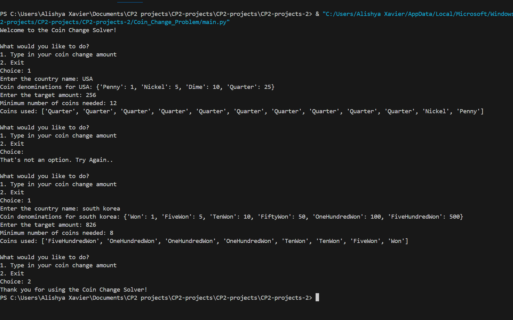

# Coin Change Problem

## Project Description
---
The purpose of this project is to make a program that allows users to solve the Coin Change Problem by inputting a target amount and the available coin denominations. The program should load the coin denominations from a file based on the user's input of a country and then calculate the minimum number of coins needed to make the target amount. The program should also display the names of the coins used in the solution. 

## Execution and Usage
---
To use this project what you have to do is run the program and then it will ask you if you would want to type in your coin change amount or exit. If you type 1 (type in the coin change amount) then it will ask the country and then show the types of coin currency from there. You then have to type in your target amount and then it will tell you how many coins and which coins are needed to get to that target amount. If you type in 2(Exit) then it exits out of the program.

## Curent Features
---
+ I am proud of my code being able to do the right calcultions to figure out the exact amount of coins needed
+ I am also proud of all of the Error handling things that are in the code that inform the user of what they did and takes them back to try again 
+ Lastly I am proud of how the code read the csv file as it took many trials and errors to get it to work properly

## Contributors
---
+ My dad - Helped me through the thought process of what was needed and how I would do that 
+ Documents - explained the necesarry syntax and ways to be able to code certain sections
+ AI - helped debug when I was working on the same problem for two days even after I tried multiple different ways  
+ Youtube videos - better understanding on how files work and how to combine inner and helper functions into my program.

## Authors Information
---
This project was completed by Alishya Xavier. She is a freshman in highschool at Utah County Academy of Sciences. She has been taking programing classes starting in middleschool to be able to learn python and enjoy using it. Some other things she enjoy doing are baking, spending time with her friends, and playing volleyball. At the moment she is trying multiple different things in highschool to be able to be open minded and enjoy every moment in whatever she decides in her future. 
