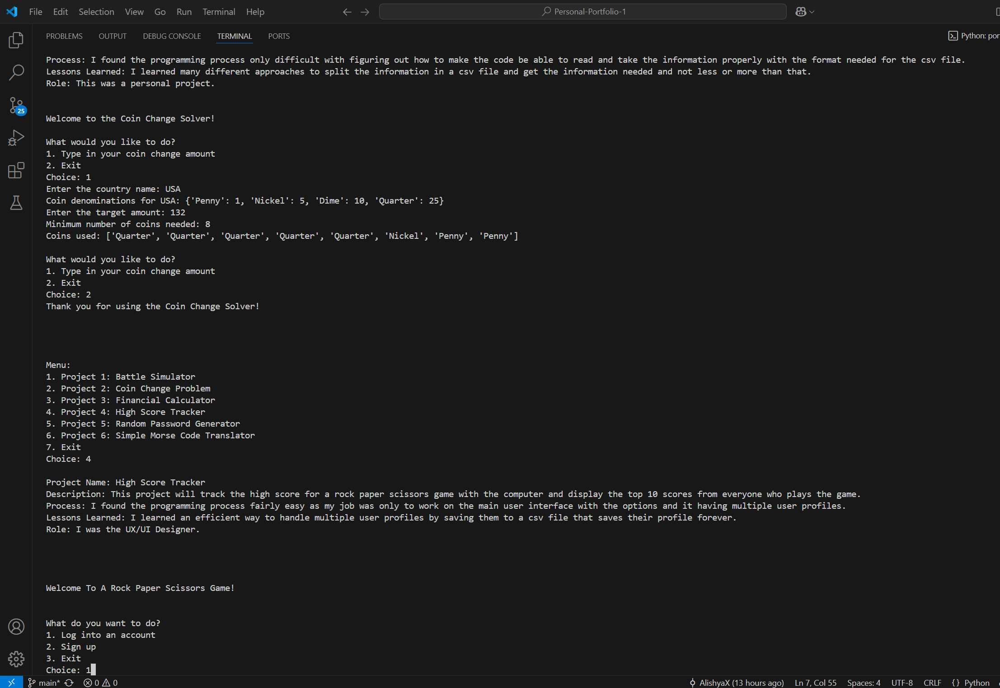

# Personal Portfolio

## Project Description
---
The purpose of this project was to create a user interface for at least 6 projects of mine that show the programming projects I am most proud of. This project explains a lot of information about my top 6 projects this year and lets the user test out all of these projects too. Specifically it talks about a description about what each project does, how the programming process was, what I learned after doing each project, and what role I took in the projects.

## Execution and Usage
---
To use this project what you have to do is first install the necessary libraries and then run the portfolio_menu file. Then it will explain what this program is and how to use it. The user then gets to choose which project they want to see information about and have run by typing in the corresponding number next to the project right next to the word choice. Then if they want to exit they type in the number 7.
  

## Used Technologies
---
+ Matplotlib
`pip install matplotlib`
+ Numpy
`pip install numpy`
+ Faker
`pip install Faker` 
+ Pandas
`pip install pandas` 

## Curent Features
---
+ I am proud of how I figured out the right syntax and way to use a function inside of a file inside of a folder
+ I am also proud of how I updated all of my old programs to fit into the portfolio_menu with having any errors or breaking the code
+ Lastly I am proud of the way I decided to hold all of the information of each project in a list of dictionaries

## Contributors
---
+ My Dad - helped me understand the correct syntax for why I couldn't take the function from a file in a folder and use it inside of my code and some other small errors
+ Copilot - helped debug some problems that neither I, google or my dad could understand 
+ My old team(John, Eli, and Locklin) - they helped make the High Score Tracker Project  

## Authors Information
---
This project was completed by Alishya Xavier but had some of her team members from her group project of the High Score Tracker help her with that program. She is a freshman in highschool at Utah County Academy of Sciences. She has been taking program classes starting in middleschool to be able to learn python and enjoy using it. Some other things she enjoy doing are baking, spending time with her friends, and playing volleyball. At the moment she is trying multiple different things in highschool to be able to be open minded and enjoy every moment in whatever she decides in her future. 
